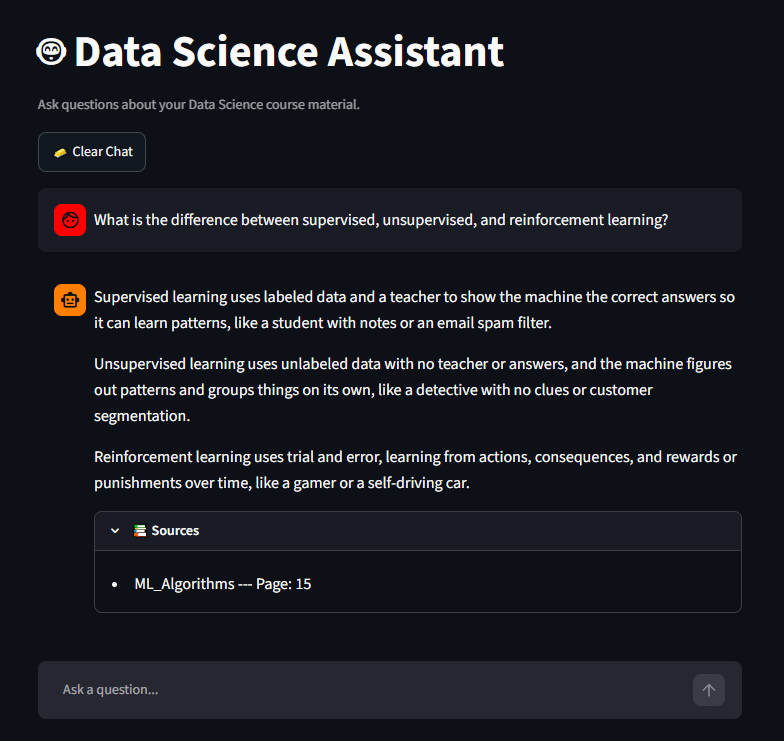

# 🤖 Data Science RAG Assistant

## Introduction

A Retrieval-Augmented Generation (RAG) based AI assistant that answers questions using a collection of Data Science course materials.
The system retrieves relevant information from the knowledge base and provides answers using the retrieved context.

## 🎯 Problem It Solves

Large collections of Data Science learning materials can make it difficult to quickly find specific information.
This project provides a conversational interface where users can ask questions about Data Science and receive answers based on the available course material instead of manually searching through multiple documents.
The assistant also displays the source documents and pages used to generate an answer.

## Demo



## 🔄 How It Works

```text
Course Documents
       ↓
Text Extraction
       ↓
Text Cleaning
       ↓
Semantic Chunking
       ↓
Embeddings
       ↓
FAISS Vector Index
       ↓
User Question
       ↓
Query Embedding
       ↓
Relevant Chunks Retrieved
       ↓
Gemini
       ↓
Answer + Sources
```

## 💻 App Interface

The application provides a conversational interface where users can:

- Ask Data Science questions
- Ask multiple questions in one message
- Receive answers based on the knowledge base
- View source documents and pages
- Continue conversations using chat history


## 🛠️ Tools & Technologies

- **Python** — Core development and RAG pipeline
- **PyMuPDF** — PDF text extraction
- **Sentence Transformers** — Generates text embeddings
- **FAISS** — Vector similarity search
- **Gemini** — Generates answers from retrieved context
- **Streamlit** — Conversational web interface
- **NumPy** — Numerical and vector processing

### Models

- **Embedding Model:** `sentence-transformers/all-MiniLM-L6-v2`
  - Produces 384-dimensional embeddings.

- **LLM:** `Gemini 3.5 Flash-Lite`
  - Generates answers using retrieved context.

## 📁 Project Structure
```text
DS-RAG-ASSISTANT/
├── app.py                  # Streamlit chat interface
├── rag.py                  # RAG pipeline
├── requirements.txt        # Python dependencies
├── data/
│   └── faiss_index/        # FAISS index and chunk metadata
├── src/                    # Data processing code and notebooks
└── README.md
```

- **`data/faiss_index/`** — contains the processed knowledge base required by the application.
- **`src/`** — contains the code and notebooks used during the data-processing stages.


## 🚀 Features

- Semantic document retrieval
- FAISS vector search
- Multi-question handling
- Context-grounded responses
- Source document and page display
- Conversation history
- Cached models and resources
- Interactive Streamlit interface

## 🔮 Future Improvements

- Improve retrieval and relevance filtering
- Improve source attribution
- Improve deployment and scalability
- Add support for additional document types

## 📌 Note

This project was built as a practical implementation of Retrieval-Augmented Generation while learning Data Science, embeddings, vector search, and LLM applications.

## Author:

**Abdul Hannan**

[GitHub](https://github.com/A-Hannan-code)

* LinkedIn: [Abdul Hannan](https://www.linkedin.com/in/abdul-hannan-2025a3395/)
